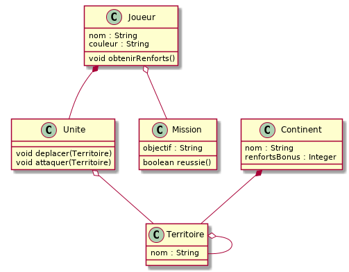

= Analyse du domaine
 
== Introduction

=== Objectif

// Décrire l'objectif de ce chapitre.

Ce chapitre constitue le premier livrable d’une série de quatre chapitres destinés à fournir une analyse et une conception par objets complètes répondant au cahier des charges qui nous a été fourni. 
Ce document présente l’ensemble de la démarche suivie ainsi que les résultats obtenus lors de la phase de l'analyse du domaine de notre système. 
Il se décompose en plusieurs parties.

=== Organisation du chapitre

Ce chapitre est organisé en 4 sections.

Dans la première partie, nous présentons de manière détaillée l’ensemble des cas d’utilisation que nous avons dégagés lors de l’analyse. 
Nous utiliserons pour cela le canevas proposé par Cockburn que nous compléterons par des instantanés ainsi que par des post-conditions exprimées en OCL (Object Constraint Language) et quelques scénarios. 
Cette partie constitue une étape clé de la phase de l'analyse du domaine.

Dans la deuxième partie, nous présentons le  diagramme de classes métiers (i.e. diagramme de classes au niveau analyse) que nous avons construit à partir de l’analyse réalisée. 
Ce diagramme fournit une vue statique et synthétique du domaine de notre projet.
Nous y ajoutons également une liste d'invariants que notre projet devra respecter.
Cette  partie constitue une étape clé de la phase de spécification des besoins.

Dans la troisième, nous fournissons le dictionnaire des données que nous avons construit suite à l'analyse du domaine. 
Il s’agit d’un listing de l’ensemble des termes relatifs au domaine étudié ainsi que leur définition précise.

Dans une quatrième et dernière partie, nous apportons un regard critique sur l'ensemble de l'analyse effectuée et présentons une conclusion sur sa pertinence.

== Cas d'utilisation

=== Mise en place d'une partie

==== Initialisation de la partie
include::use-case-initialisation.adoc[leveloffset=+2]
//add snapshot

==== Attribution des couleurs
include::use-case-attribuer-couleur.adoc[leveloffset=+2]
//fait

==== Distribution des missions
include::use-case-donner-mission-tous-les-joueurs.adoc[leveloffset=+2]
//add snapshot

==== Distribution d'une mission par joueur
include::use-case-donner-mission-a-un-joueur.adoc[leveloffset=+2]
//add snapshot

==== Distribution des unités
include::use-case-distribuer-unites.adoc[leveloffset=+2]
//fait

==== Distribution des territoires
include::use-case-donner-territoires.adoc[leveloffset=+2]
//fait

==== Déploiement des unités
include::use-case-deploiement-unites.adoc[leveloffset=+2]
//

==== Déploiement d'une unité
include::use-case-deploiement-unite-seule.adoc[leveloffset=+2]
//TO DO

=== Déroulement de la partie

==== Jouer un tour
include::use-case-jouer-un-tour.adoc[leveloffset=+2]

==== Distribution des renforts
include::use-case-donner-renforts.adoc[leveloffset=+2]

==== Déroulement d'un combat
include::use-case-attaque-territoire.adoc[leveloffset=+2]

==== Déroulement d'un déplacement
include::use-case-deplacement.adoc[leveloffset=+2]

==== Fin d'un tour
include::use-case-fin-de-tour.adoc[leveloffset=+2]

== Modèle de classes du domaine

== Invariants

[source,ocl]
----
context Continent inv: 
        renfortsBonus>=0

context Joueur::obtenirRenforts() : Integer
post: result>=3

context Unite::attaquer(arrivee : Territoire)
pre: self.territoire <> arrivee

context Unite::deplacer(arrivee : Territoire)
def: depart : Territoire = self.territoire
pre: depart <> arrivee
post: self.territoire = arrivee 
----

== Dictionnaire de données
	
include::terms.adoc[]

== Conclusion

