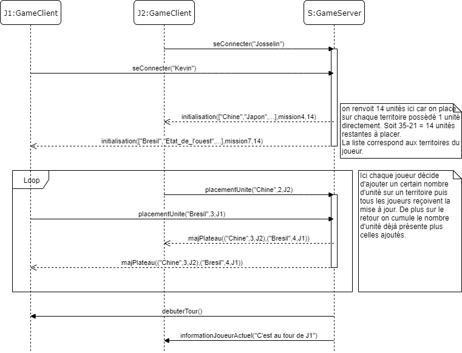

= Conception préliminaire

== Introdutcion

Cette partie correspond à la "conception préliminaire" du projet. Elle comprend la division de la solution en différents composants, l'explication des fonctionnalités attendues de chaque composant, la spécification des interfaces fournies par chaque composant, ainsi que des diagrammes de séquence qui valident ces interfaces.

=== Objectif

A partir des exigences formulées et de l'étude du domaine effectuée précédemment, nous pouvons désormais commencer à imaginer les bases de notre application. Pour cela, nous commencerons par définir les différents composants du système, remplissant chacun des fonctions bien distinctes. Ensuite, nous serons en mesure de déterminer des interfaces pour chacun de ces composants, qui leur permettra de communiquer et d'interagir efficacement.

=== Organisation du chapitre

Dans ce chapitre nous commencerons par faire un description globale des composants. Suite à cela, nous approfondirons chacun d'eux dans une section spécifique, afin de bien visualiser et comprendre leur intérêt et fonctionnement.

== Description des composants 

Le système se distingue en deux parties principales :

* La partie client, qui gère les interactions avec le joueur.
* La partie serveur, qui effectue les opérations sur le jeu et garde en mémoire l'état de la partie.

Il est assez évident d'effectuer une décomposition en deux composants en partant de ces deux acteurs. De plus, nous ajouterons l'utilisation d'une base de données afin de stocker toutes les informations semblables d'une partie sur l'autre, comme la composition de la carte, les missions, etc...

Le composant Web Client devra être capable de gérer les actions d'un joueur et de les communiquer vers le serveur. Ainsi, nous devrons définir des opérations permettant de se connecter au serveur, d'envoyer les informations nécessaires au calcul des actions par le serveur, et également de recevoir et traduire les mises à jour transmises par le serveur. 

Le composant Game Server devra quant à lui être en capacité d'effectuer l'initialisation d'une partie avec des clients ayant fait un requête de connexion. De plus, il devra gérer les opérations relatives au déroulement d'une partie grâce aux informations envoyées par les joueurs, modifier en conséquence l'état du jeu et leur transmettre le résultat à chaque étape.

//////
Établir les frontières du système.

Division du système en composants.

Décrire le comportement souhaité des composants.
//////

== Le composant `Game Server`

Comme mentionné précedemment, ce composant aura différentes fonctionnalités. En effet, il devra tout d'abord être capable de créer et initialiser une
partie lors d'une demande de connexion. De plus, il sera interrogé à chaque étape de chaque tour d'un joueur, et ce jusqu'a la fin de la partie. Il
devra donc pouvoir gérer la distribution des renforts, les attaques, la défense et les déplacements. Au sein d'un même tour, afin de permettre
aux joueurs de visualiser les modifications apportées, de nombreux échanges auront lieu entre le client et le serveur, et ce dernier devra à chaque fois
être en mesure de mettre à jour l'état de la partie, et de le communiquer aux autres joueurs.

=== Spécification des interfaces

==== Spécification de l'interface A
	
////
Présentation de l'interface en UML (ou HUTN). 
Description du comportement de chaque opération. 
Spécification éventuelle des pré-conditions en OCL.
////

[plantuml, interface-gameserver-a, png]
----
@startuml

left to right direction

Component WebClient
Component GameServer

seConnecter -- GameServer
WebClient ..> seConnecter

deployerUnite -- GameServer
WebClient ..> deployerUnite

@enduml
----

Cette interface doit permettre l'initialisation d'une partie côté serveur.

L'opération seConnecter() est appelée par un client, qui est ensuite placé dans un lobby approprié en attendant le début d'une partie.

L'opération deployerUnite() est appelée par un client à l'issu de la distribution des ressources de début de partie. Le client doit alors transmettre les unités qu'il place sur chacun de ses territoires.

==== Spécification de l'interface B 

[plantuml, interface-gameserver-b, png]
----
@startuml

left to right direction

Component WebClient
Component GameServer

placerRenforts -- GameServer
WebClient ..> placerRenforts

attaquer -- GameServer
WebClient ..> attaquer

deplacer -- GameServer
WebClient ..> deplacer

finirTour -- GameServer
WebClient ..> finirTour

@enduml
----

Cette interface permet aux joueurs le calcul et la prise en compte des actions qu'ils ont entrepris.

L'opération placerRenforts() sera déclenchée au début de chaque tour. Elle distribue les renforts du joueur et attend que ce dernier ai choisi où les placer.
Lorsque le joueur aura fait son choix, il validera et le cient enverra alors au serveur les différentes modifications à apporter et à communiquer aux
autres joueurs.

L'opération attaquer() sera déclenchée lorsque placerRenforts() est terminée. Si le joueur souhaite attaquer un territoire, alors il spécifie avec combien
d'unités, et cette information est envoyée au serveur. Une fois reçue, ce dernier va demander au joueur qui se fait attaquer s'il souhaite se défendre,
et avec combien d'unités. Cette information récupérée, le serveur va calculer le résultat du combat et le communiquer à tous les joueurs, en mettant
à jour le plateau.

L'operation deplacer() sera déclenchée lorsque le joueur aura fini d'attaquer. Si le joueur souhaite déplacer des unités d'un territoire à un autre,
les informations necessaires seront envoyées au serveur, et une mise à jour du plateau sera renvoyée à tous les joueurs.

L'operation finirTour() sera déclenchée soit lorsque le joueur aura choisi de terminer son tour, soit lorsque son temps imparti de jeu sera écoulé.

== Le composant `Web Client`

Le composant Web Client devra être en mesure de gérer les actions d'un joueur et de les communiquer vers le serveur. Il comprendra donc des opérations
lui permettant de se connecter au serveur, de récupérer et d'envoyer les informations necessaires au serveur lors de chacune de ses actions afin que
celui-ci soit capable de calculer les résultats des actions. De plus, le composant Web Client devra aussi pouvoir recevoir et interpeter les mises à
jour transmises par le serveur.

=== Spécification des interfaces

==== Spécification de l'interface A
	
Présentation de l'interface en UML (ou HUTN). 
Description du comportement de chaque opération. 
Spécification éventuelle des pré-conditions en OCL.

[plantuml, interface-webclient-a, png]
----
@startuml

left to right direction

Component WebClient
Component GameServer

attribuerCouleur -- WebClient
GameServer ..> attribuerCouleur

attribuerMission -- WebClient
GameServer ..> attribuerMission

attribuerTerritoire -- WebClient
GameServer ..> attribuerTerritoire

attribuerUnite -- WebClient
GameServer ..> attribuerUnite

@enduml
----

Cette interface doit permettre l'initialisation d'une partie côté client.

Chacune des méthodes sera appelée au début de la partie.

La méthode attribuerCouleur() permettra au client de connaître quelle sera la couleur qu'il portera lors du déroulement de la partie.

La méthode attribuerMission() lui permettra de connaître la mission qu'il doit effectuer afin de gagner la partie.

La méthode attribuerTerritoire() lui permmettra de savoir quels territoires lui ont été attribués, afin qu'il puisse ensuite placer les unités qu'il
va recevoir.

La méthode attribuerUnite() lui permettra donc de récupérer ses unités afin de les placer sur le plateau.

==== Spécification de l'interface B 

[plantuml, interface-webclient-b, png]
----
@startuml

left to right direction

Component WebClient
Component GameServer

debuterTour -- WebClient
GameServer ..> debuterTour

donnerRenforts -- WebClient
GameServer ..> donnerRenforts

resultatCombat -- WebClient
GameServer ..> resultatCombat

mettreAJour -- WebClient
GameServer ..> mettreAJour

@enduml
----

== Interactions

Objectif: décrire, à haut-niveau, la collaboration entre les composants majeurs, en faisant référence aux besoins.

Utiliser des interactions, c'est à dire, des diagrammes de séquence et des diagrammes de communication. 

** Ne vous limitez pas à une seule interaction par cas d'utilisation

=== Mise en place d'un jeu

==== Interaction: cas nominal

==== Interaction: cas A

==== Interaction: cas B

=== Tour d'un joueur 

==== Interaction: cas nominal

==== Interaction: cas A

==== Interaction: cas B
